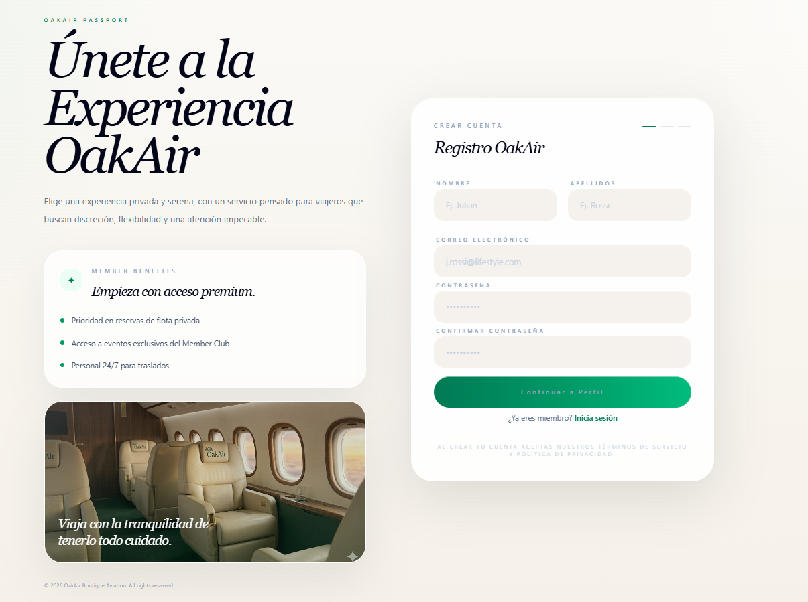
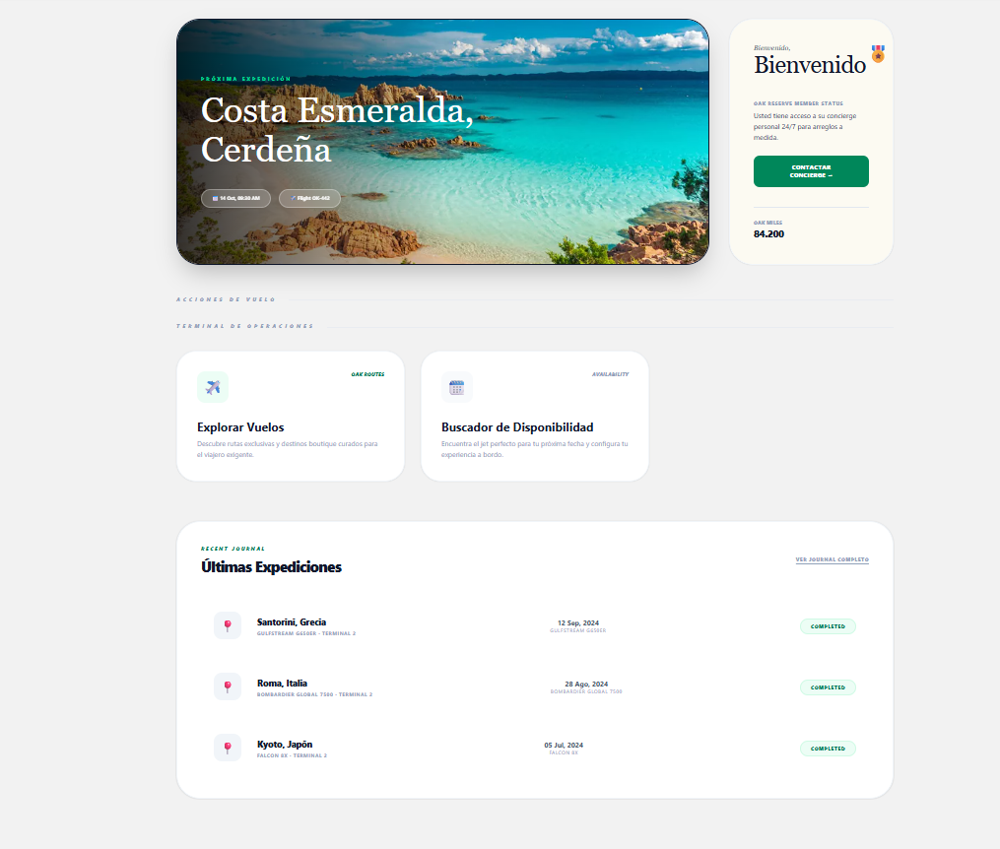
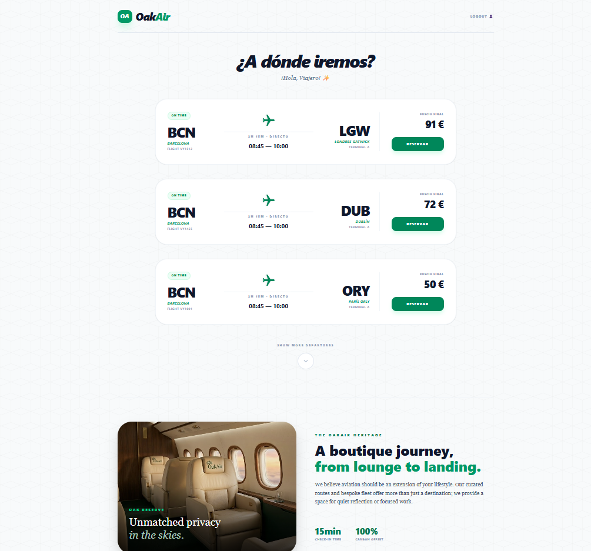
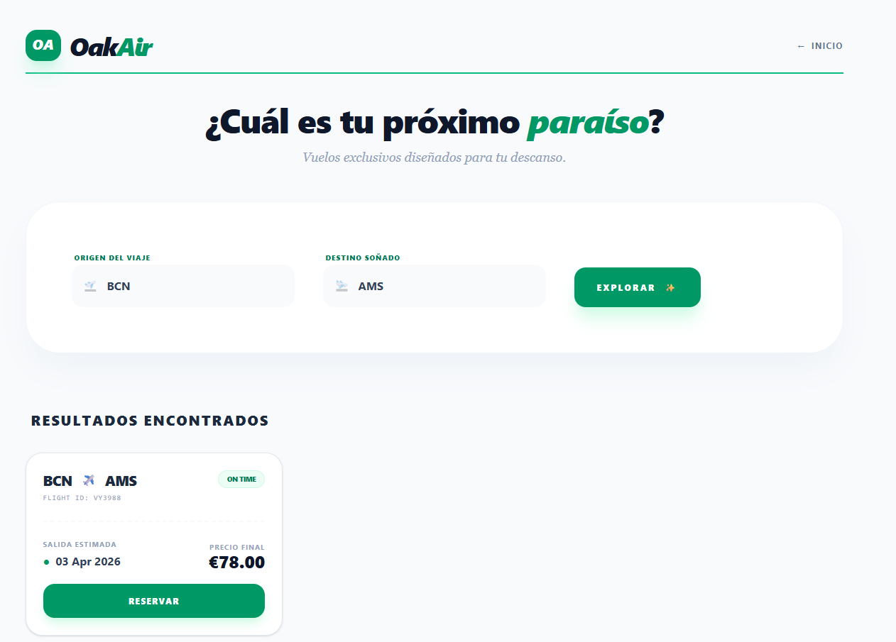
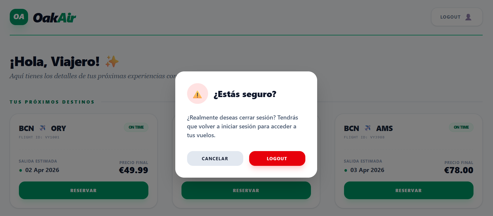
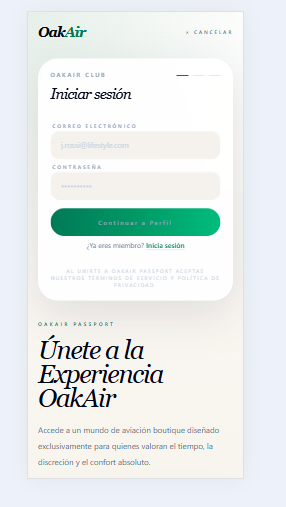

# Oak Air App - Angular Portfolio Project

Aplicacion SPA hecha con Angular Standalone para practicar y demostrar habilidades en:

- autenticacion con JWT
- rutas protegidas con guard
- manejo de formularios reactivos y validaciones
- arquitectura por servicios intercambiables (API real o local)
- componentes reutilizables

Este repo esta pensado para mostrar implementacion tecnica, decisiones de arquitectura y capacidad de evolucion del producto.

## Demo funcional (que se puede probar hoy)

- Login y Register completos.
- Dashboard privado.
- Listado y buscador de vuelos.
- Interceptors para token y errores globales.
- Persistencia de sesion por localStorage.
- Modo local sin backend para demo inmediata.

## Stack tecnico

- Angular 21 (Standalone API)
- TypeScript
- RxJS
- Angular Router + Functional Guards
- Http Interceptors
- Angular Signals (estado de autenticacion)
- Tailwind CSS

## Arquitectura resumida

La app usa abstracciones para desacoplar reglas de negocio del origen de datos:

- AuthService (abstracto)
- FlightService (abstracto)
- Implementaciones por entorno:
  - ApiAuthService / ApiFlightService
  - LocalAuthService / LocalFlightService

La seleccion de implementacion se hace en tiempo de arranque usando environment.useLocalData.

```text
src/
  app/
    auth/
    components/
    guards/
    model/
    services/
    shared/
    utils/
  environments/
  interceptor/
```

## Funcionalidades clave

### 1) Autenticacion

- Login en modo API (backend real) o modo local (simulado).
- Token JWT guardado en localStorage.
- Lectura de payload y validacion de expiracion.
- Logout con limpieza de estado + redireccion.

### 2) Seguridad de rutas

- authGuard para proteger:
  - /dashboard
  - /flights
  - /search
- Redireccion automatica a /login si no hay sesion valida.

### 3) Formularios y validaciones

- Reactive Forms.
- Reglas nativas: required, minlength, email.
- Reglas custom: password strength, forbidden name, confirm password.
- Mapeo de errores de backend a mensajes por campo.

### 4) Vuelos

- Read: listado de vuelos.
- Search: filtro de vuelos desde la UI.
- Datos desde API o semilla local segun entorno.

## Scripts

```bash
npm install
npm run start        # dev por defecto (API)
npm run start:api
npm run start:local  # demo sin backend
npm run build
npm run build:api
npm run build:local
npm run test
```

Frontend en: http://localhost:4200

## Como probar el proyecto (paso a paso)

### Opcion A (recomendada): probar sin backend en modo local

1. Instala dependencias:

```bash
npm install
```

2. Levanta la app en modo local:

```bash
npm run start:local
```

3. Abre en navegador:

http://localhost:4200

4. Prueba el flujo completo:

- Entra a /register y crea un usuario.
- Inicia sesion en /login con ese usuario.
- Verifica acceso a /dashboard, /flights y /search.
- Cierra sesion y confirma redireccion a /login.

💡Nota importante (modo local): la primera vez debes registrarte antes de intentar iniciar sesion.
No hay usuarios precargados en localStorage.

Que usa internamente este modo:

- Usuarios y token en localStorage.
- Vuelos semilla en localStorage.
- No requiere backend externo.

### Opcion B: probar con backend/API

1. Instala dependencias:

```bash
npm install
```

2. Levanta tu backend en puerto 3000 (debe cumplir el contrato de esta README).

3. En otra terminal, levanta el frontend en modo API:

```bash
npm run start:api
```

4. Abre en navegador:

http://localhost:4200

5. Valida login/register/flights contra API real.


### Problemas comunes

- Error de CORS en modo API:
  - habilita CORS en backend para http://localhost:4200
- Error de conexion al backend:
  - verifica que API este en http://localhost:3000
- No ves vuelos en modo local:
  - limpia localStorage del navegador y recarga

## Entornos

- API mode: src/environments/environment.ts
- Local mode: src/environments/environment.local.ts

El modo local se activa con file replacement usando la configuracion local de angular.json.

## Contrato esperado de backend (modo API)

Base URL: http://localhost:3000

### POST /auth/login

Request:

```json
{
  "email": "oak@example.com",
  "password": "Pass1234"
}
```

Response 200:

```json
{
  "token": "eyJhbGciOi...",
  "username": "oakland",
  "expiresIn": 28800
}
```

JWT payload minimo esperado:

```json
{
  "username": "oakland",
  "exp": 1760000000
}
```

### POST /auth/register

Request:

```json
{
  "username": "oakland",
  "email": "oak@example.com",
  "password": "Pass1234"
}
```

Response: 200 o 201

Error esperado:

- 409 cuando email ya existe.
- 400 con errores por campo:

```json
{
  "errors": [
    { "field": "email", "message": "email invalido" },
    { "field": "password", "message": "password debil" }
  ]
}
```

### GET /flights

Response 200:

```json
[
  {
    "id": "VY1001",
    "origin": "BCN",
    "destination": "ORY",
    "price": 49.99,
    "date": "2026-04-02"
  }
]
```

La app envia header Authorization: Bearer <token> si hay sesion activa.

## Rutas principales

- /login
- /register
- /dashboard (privada)
- /flights (privada)
- /search (privada)

## Estado de calidad

- Build local validado con exito (npm run build:local).

## Capturas de pantalla

### 1) Login (nuevo diseño 2026)


### 2) Registro con validaciones (nuevo diseño)



### 3) Dashboard privado



### 4) Listado de vuelos



### 5) Busqueda de vuelos



### 6) Confirmacion de logout (nuevo diseño)



### 7) Vista responsive




## Proximos pasos y mejoras

Este roadmap resume los siguientes pasos para seguir mejorando el proyecto.

- Completar Update/Delete para cerrar CRUD.
- Mejorar cobertura de tests unitarios.
- Agregar manejo de refresh token.
- Agregar estados loading/empty/error mas detallados.

